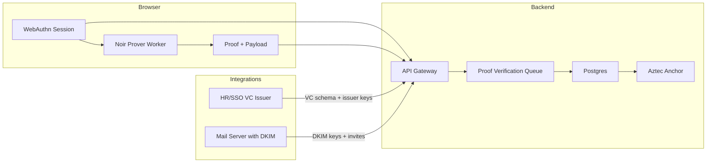

# Architecture blueprint

This document captures the end-to-end design for the private-yet-verifiable workspace application.

## Product capabilities

- Organizations self-serve onboarding, verify their corporate domain, and choose how members prove employment
  (Verifiable Credential via SSO/HR or zkEmail via DKIM-signed invites).
- Members generate a private secret in-browser and enroll through a zero-knowledge proof, registering an anonymous commitment
  into the organization Merkle tree.
- Authenticated members post anonymously to channels and participate in one-person-one-vote or weighted polls.  Rate-limiting
  nullifiers (RLN) prevent spam while keeping identities hidden.
- The platform stores proofs, commitments, and content only—never raw identity data.

## System overview

### Frontend responsibilities

- WebAuthn passkey session bootstrapping.
- Invite onboarding flow: secret generation, VC or zkEmail proof preparation, Noir proof invocation in a WebWorker.
- Channel and poll interfaces that compile posts/votes into proofs and submit them to the backend.
- Client-side storage of Merkle proofs and commitment metadata.

### Backend responsibilities

- Serve public configuration (org verification modes, issuer keys, current Merkle root).
- Accept proofs for enrollment, posts, and votes; enqueue verification jobs; update Merkle trees and nullifier registries.
- Persist channel content and poll ballots in Postgres, keyed by nullifiers and commitment hashes.
- Optionally anchor Merkle roots and consumed nullifiers to Aztec for auditability.

### Noir circuit scope

1. `enroll.nr` – verifies employment proof (VC or zkEmail) and emits member commitment + enrollment nullifier.
2. `signal.nr` – enforces Merkle membership and RLN quota when posting/comments.
3. `vote.nr` – enforces single vote per poll with private choice commitment; includes tally proof outline.
4. `vote_weighted.nr` (v2) – adds committed weight registry for shareholder voting.

## Data model

| Table | Purpose | Key fields |
|-------|---------|------------|
| `org` | Organization configuration | `id`, `name`, `domain`, `verification_modes`, `tree_root_current` |
| `org_key` | Cached issuer and DKIM keys | `org_id`, `issuer_pubkeys`, `dkim_keys` |
| `membership` | Merkle tree leaves | `org_id`, `leaf_index`, `commitment`, `enrolled_at` |
| `nullifier` | RLN / vote deduplication | `org_id`, `scope_type`, `scope_id`, `nullifier`, `created_at` |
| `channel` | Anonymous discussion channels | `id`, `org_id`, `name`, `rln_quota` |
| `post` | Channel messages | `id`, `channel_id`, `content_ptr`, `proof_hash`, `post_nullifier`, `created_at` |
| `poll` | Poll metadata | `id`, `org_id`, `question`, `options`, `mode`, `start`, `end`, `tally`, `tally_proof` |
| `ballot` | Encrypted ballots | `poll_id`, `commitment_ptr`, `proof_hash`, `vote_nullifier`, `received_at` |

`content_ptr` may reference local text storage or IPFS for independent auditing.

## Proof lifecycles

### Enrollment

1. Admin issues invites.
2. Member opens invite, generates secret, chooses VC or zkEmail path.
3. Client obtains issuer/DKIM keys from backend and constructs the Noir witness.
4. `enroll.nr` runs inside the browser worker, outputting `member_commitment` and `enroll_nullifier`.
5. Backend verifies proof, inserts leaf into org tree, updates current root, stores history.

### Anonymous post / comment (RLN)

1. Member retrieves latest Merkle proof and RLN quota.
2. Worker runs `signal.nr` to produce scope nullifier and RLN tag.
3. Backend ensures nullifier uniqueness for `(org, channel, epoch)` and enforces rate limit.
4. Post stored with proof hash and nullifier for audits.

### Poll vote (1p1v)

1. Member fetches poll metadata and encryption parameters.
2. Worker runs `vote.nr`, producing a nullifier and encrypted vote commitment.
3. Backend stores ballot, ensures nullifier uniqueness, and includes in tally pipeline.
4. Tally worker aggregates ballots, computes homomorphic sum, and produces tally proof.

## Security posture

- No PII stored; proofs/commitments are unlinkable without issuer cooperation.
- Merkle root rotations with history retention; proofs accepted for defined grace window.
- RLN prevents spam; moderators authenticated via their own ZK credential path.
- Optional break-glass re-identification via external trustee service.

## Open tasks

- Implement Noir circuits per specification and integrate Barretenberg WASM build.
- Flesh out backend proof verification pipeline (Noir verifier bindings, Aztec anchoring).
- Build complete admin + member flows in the Next.js frontend.
